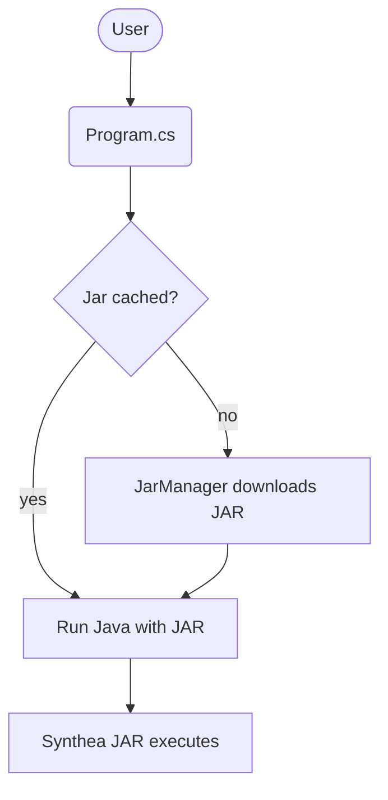

# Architecture

This repository contains a small .NET command-line wrapper around the official Synthea JAR. The CLI downloads the JAR on demand and launches it with user-provided options. The actual Synthea project is maintained separately by MITRE.

## synthea-cli program



`Program.cs` defines the command-line interface and orchestrates fetching the JAR via `JarManager`. `JarManager` checks a cache directory under the user's profile, hitting GitHub releases if necessary and verifying checksums. Once the JAR is ensured, `Program.cs` spawns a Java process and streams the output back to the console.

## Synthea overview

The Synthea JAR itself is not included here. At a high level, Synthea is a Java application that simulates patients through state-machine modules and exports synthetic health records.

```mermaid
flowchart TD
    AA[CLI / Java entry] --> BB[Generator]
    BB --> CC[Modules & States]
    CC --> DD[Patient records]
    DD --> EE[Exporters (CSV/FHIR/HL7)]
    EE --> FF[Output directory]
```

The CLI simply launches this JAR with user-supplied arguments to control the simulation size, output location, and other options.
