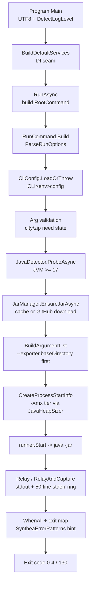

# SyntheaCli 1.0.0 — Architecture Review Report

**Date:** 2026-06-13
**Reviewed by:** Claude Fable 5 (ultracode), multi-agent orchestrated
**Scope:** Full repository — build/CI/distribution, `synthea run` end-to-end flow, test coverage, supply-chain & doc drift. Source under `src/Synthea.Cli/`, `tests/`, `.github/workflows/`, `Dockerfile`, `docs/adr/`.
**Commit:** `871b126` — tag `v1.0.0` (`chore(release): 1.0.0`)
**Method:** 3 discovery mappers (build/CI/dist · run-flow · test/doc-drift) → 9 dimension reviewers (structure, design, data, scalability, reliability, observability, security, maintainability, operational) → adversarial verification of each finding → completeness critic. Severity is impact × realistic likelihood, not worst case.

---

## Executive summary

- **No actively-exploitable Critical exposure.** The highest-consequence item (F-001) is a real supply-chain weakness, but it requires GitHub/TLS compromise or local-write access, so it is rated **High**, not Critical. Ship-blocking it is a judgment call; closing it is cheap and worth doing.
- **The tool downloads and executes an unverified JAR by default (F-001).** Checksum verification is opt-in *and* inert against the real upstream (Synthea publishes no `.sha256`), so the normal NuGet path runs unverified JVM code. Pinning a known-good SHA-256 in the binary — as the Docker image already does for the engine version — removes the dependency on a nonexistent upstream asset.
- **The thing the tool exists to do is effectively untested (F-005).** Exactly one test spawns a real `java -jar` and it self-skips-as-*fail* when Java is absent; CI never provisions Java. A regression in the spawn/exit-code/stream-pump path reaches a release tag green. Convert it to a real skip + `actions/setup-java`.
- **Tag-push publishes to nuget.org with no test or coverage gate (F-006).** `ci.yml` runs on branch/PR only, not on tags; `nuget.yml` packs and pushes with no `dotnet test` and no `--skip-duplicate`. A bad or duplicate tag ships an irreversible public package. Gate the publish on a passing CI run for the same SHA.
- **The 1.0.0 exit-code contract disagrees with the code (F-002).** README says `1 = argument error`, but the single most likely first-run failure — Java not found — returns `3` (documented as "GitHub unreachable / checksum mismatch"), sending new users to debug the wrong subsystem. Reconcile the table and pin codes with exact-value assertions.
- **A `-p 200000` run auto-requests `-Xmx8g` with no host-RAM check (F-003),** turning a slow run into an immediate opaque JVM "could not reserve space" crash on a typical laptop/CI runner. Clamp the heap tier to a fraction of available memory.
- **First-run network has no body-read timeout (F-004):** a stalled mid-download connection hangs the terminal indefinitely with no retry — the most likely place a new user gets stuck.
- **Strengths to preserve:** GA-pinned dependencies, golden `--help` snapshot tests, a real Docker smoke test, single-sourced version, bounded stderr/stream buffers, and clean config-precedence resolution. Don't regress these while fixing the above.

---

## System overview

SyntheaCli is a thin, well-seamed wrapper that translates a friendly CLI surface into a `java -jar synthea.jar …` invocation. Composition happens once at a static seam (ADR-001); all cross-boundary collaborators are interfaces resolved in `Program.BuildDefaultServices`. Static helpers (`JavaHeapSizer`, `SyntheaErrorPatterns`, `UsStates`, `SyntheaProgressParser`, `CliConfig`) are pure leaves and intentionally un-seamed.

**Component map**

```
Program (composition root, static-seam DI)
  ├─ IProcessRunner → DefaultProcessRunner
  ├─ IJavaDetector  → JavaDetector(IProcessRunner)
  ├─ IJarSource     → JarManager(HttpClient, ILogger)
  └─ IFileSystem / IDiskSpaceProbe / IGitHubReachabilityProbe   (doctor-only)

RootCommand
  ├─ run      → RunCommand   (PRIMARY: option surface, parse→args, download, spawn, exit-map)
  ├─ cache    → CacheCommand (list/clear)
  ├─ doctor   → DoctorCommand (6 env checks)
  └─ modules  → ModulesCommand (list/describe via ModuleIntrospector)
```

**`synthea run` flow (top-level, ≤15 nodes)**



**Corrections surfaced by the review:**
- **Two directories are both called "cache."** `JarManager` caches JARs under `%LOCALAPPDATA%\Synthea.Cli`; `ModulesCommand`/`CliConfig` use `~/.synthea-cli`. `ModulesCommand` passes the *module-meta* dir into `ListJarModules`, not the JAR cache. Intentional (different invalidation models) but a genuine comprehension/clean-uninstall hazard — `cache clear` does not sweep module-cache JSON. (F-013)
- **`--version`/`doctor` reach across the DI seam** into `RunCommand.ResolveOverrideJar()`, a static that reads env + config file directly — re-introducing the untestable coupling ADR-001 removed, relocated into a static method. (F-014)
- **Verified accurate:** output-lands-in-`-o` (`--exporter.baseDirectory=<abs>`), version single-sourcing, Java≥17 floor, cache path docs, config precedence.

---

## Strengths (preserve these)

- **GA dependencies, pinned and grouped.** `System.CommandLine 2.0.8` (GA, not beta), DI/Logging `10.0.8`, xUnit `2.9.3` — and `dependabot.yml` groups xunit/Test.Sdk/coverlet to avoid churn. The beta4→GA migration is locked by a regression test that asserts the beta API can't load (ADR-0003, `ProgramRefactorTests.cs:23-44`).
- **Golden `--help` snapshot tests.** `HelpSurfaceTests.cs:71-104` spawns the real CLI and diffs against `golden/help-{root,run,cache,doctor,modules}.txt` — the help surface (a real part of first-impression UX) is contract-tested.
- **A genuine end-to-end Docker smoke gate.** `docker.yml:83-90` runs `--version`, `doctor`, then `run -p 1 --state OH` and asserts `fhir/*.json` exists before pushing — the only place the tool's core promise is verified e2e.
- **Single version source.** `Synthea.Cli.csproj:12-18` drives PackageVersion/AssemblyVersion/InformationalVersion; `IncludeSourceRevisionInInformationalVersion=false` keeps semver clean for the no-`.git` Docker build; CI overrides via `/p:Version`.
- **Bounded buffers everywhere a large run could leak.** 50-line stderr ring (`ProcessHelpers.cs:60-73`), single-int progress state (`SyntheaProgressParser.cs:30-39`), 81920-byte streamed download (`JarManager.cs:241-249`). Memory stays flat regardless of `-p`. (Positive finding — don't regress in a future "capture all stderr" refactor.)
- **Clean, robust config resolution.** CLI>env>config>default precedence (`CliConfig.cs:85-89`), case-insensitive JSON with comment/trailing-comma tolerance (`:20-23`), strict-vs-tolerant load split, and `envGetter` delegates that avoid process-wide env mutation under parallel tests. (Positive finding.)
- **Self-contained + air-gapped distribution done thoughtfully.** Non-root uid 1000, native-lib install, JAR baked in with `SYNTHEA_CLI_JAR_PATH` so `JarManager` short-circuits with no GitHub call (`Dockerfile:92-97`), optional corporate root CA that is a no-op when absent, and a download size-guard against HTML rate-limit interstitials (`Dockerfile:66-68`).
- **Atomic download ordering.** `DownloadAsync` writes to a temp file, verifies (when a checksum exists), then `File.Move(..., overwrite:true)` with `finally` cleanup (`JarManager.cs:176-197`) — the write path itself is correct; the gap is *reuse*, not *download*.

---

## Findings

IDs assigned in severity order. Severity = impact × realistic likelihood.

| ID | Sev | Dimension | Evidence (path:line) | Impact | Recommendation (first step) |
|----|-----|-----------|----------------------|--------|------------------------------|
| **F-001** | High | security | `JarManager.cs:179` (`if (shaUrl is not null)`), `:162-165`; spawn at `RunCommand.cs:511-512` → `ProcessHelpers.cs:27`. Upstream publishes no `.sha256`. | Default NuGet path fetches `browser_download_url` and runs it as `java -jar` with no signature/hash/pinning. Verification is opt-in *and* inert against the real upstream. A tampered/MITM'd asset = arbitrary JVM code execution. | Pin a known-good SHA-256 of the targeted Synthea release in the binary (Docker already pins v4.0.0) and verify after `DownloadAsync` (`JarManager.cs:176`) before first `Process.Start`. |
| **F-002** | Medium | observability | `README.md:289-296` vs `RunCommand.cs:200` (Java-not-found→3), `:207` (too-old→1), `:171` (bad config→1). Contract frozen at `README.md:305`. | The most likely first-run failure (no Java) returns code `3`, documented as "GitHub unreachable / checksum mismatch" — sends users to debug the wrong subsystem, and docs/code disagree on a SemVer-locked contract. | Rewrite the table so `3` = external-dep OR Java-not-found and `1` = arg/too-old/bad-config; pin each with exact-value assertions. |
| **F-003** | Medium | scalability | `JavaHeapSizer.cs:18-21` (4g/8g/16g tiers) applied unconditionally at `RunCommand.cs:508-510`; no `GC.GetGCMemoryInfo()` check. | `-p 200000` auto-requests `-Xmx8g` (16g at 1M+). On an 8-16GB host the JVM fails fast with "Could not reserve enough space" — the tier meant to *help* large runs converts them to immediate opaque crashes. | Clamp the suggested tier to ~70% of `TotalAvailableMemoryBytes` and emit a one-line stderr note when clamping. |
| **F-004** | Medium | reliability | `JarManager.cs:232` (`ResponseHeadersRead`) + `:244` stream loop; `Program.cs:73` builds `HttpClient` with no `Timeout`. | With `ResponseHeadersRead`, the default 100s timeout covers only headers; the ~180MB body read has no deadline and no retry. A stalled connection hangs the first run with no error — only Ctrl+C escapes. | Wrap `DownloadAsync` in a `CancelAfter` linked CTS for a per-attempt read timeout; add a 2-attempt bounded retry around download/API. |
| **F-005** | Medium | maintainability | `SyntheaCliWrapperRunTests.cs:62-98` (`SkipTestException`→`Assert.Fail("SKIPPED…")` at `:153-157`); all other run tests stub `IProcessRunner`. `DefaultProcessRunner`/`ProcessHelpers.Relay` untested. | The JAR-execution contract — the tool's reason to exist — has near-zero enforced coverage. A regression in spawn/exit-mapping/stream-pump passes CI; only the tag-push Docker smoke test catches it, after `master`. | Convert to a real skip (`Xunit.SkippableFact`) and add `actions/setup-java` to `ci.yml` so the test actually runs and gates. |
| **F-006** | Medium | operational | `nuget.yml:26-33` packs + `dotnet nuget push` with no `dotnet test`, no `--skip-duplicate`; `ci.yml:4-7` runs on branch/PR only, not tags. | A `v*` tag publishes to public nuget.org without that ref's tests/coverage/format gate ever running. nuget.org is unlist-only (never delete); a re-pushed corrected tag hard-fails without `--skip-duplicate`. Highest-likelihood operational footgun. | Add `dotnet test --filter Category!=Integration` (or `needs:` a reusable CI workflow on the tag) before push; add `--skip-duplicate`. |
| **F-007** | Medium | security | `Dockerfile:58-68` curl JAR, only `test size > 10MB`, no SHA; `ARG SYNTHEA_VERSION=v4.0.0` is a mutable Git tag. | The air-gapped image bakes in an unhashed download; a re-cut/compromised asset becomes baked-in JVM code for every consumer, with the tag giving false reproducibility confidence. | Pass the JAR SHA-256 as a build ARG, verify in the jar stage before COPY, record it in an OCI label. |
| **F-008** | Medium | structure | (positive→watch) `RunCommand.cs` is 1071 lines: Build+spawn+exit-map (`:143-297`), `BuildArgumentList` (`:302-491`), ~25 option factories (`:703-1070`), config resolution (`:651-674`). | Low cohesion; other modules reach into it (F-014), and the orchestration path is only stub-tested. Largest surface where separation-of-concerns has eroded — the place future bugs will accrete. | Extract a `SyntheaArgvBuilder` (flag translation) and `RunPipeline` (download→spawn→pump→exit-map); leave `RunCommand` as System.CommandLine wiring — gives the orchestration path a test seam. |
| **F-009** | Low | data | `JarManager.cs:117-124` selects newest `*with-dependencies.jar` by `LastWriteTimeUtc`, returns for execution with no size/hash re-check; checksum verified only at download (`:179`). | Any file matching the glob dropped into `%LOCALAPPDATA%\Synthea.Cli` (tamper, or a truncated prior download) is trusted and run on the next invocation; `--insist-checksum` is a no-op on cache hits. | Persist the verified hash as a sidecar at download; re-verify on reuse. Cheap interim: skip sub-10MB/zero-byte files in the selection glob. |
| **F-010** | Low | data | `JarManager.cs:120-128` returns any cached JAR when `!forceRefresh`; `releases/latest` is queried only on miss/`--refresh`. | Once cached, the global tool uses that engine indefinitely regardless of upstream releases — silent staleness; "latest" really means "latest-as-of-first-download," diverging from the version-pinned Docker image. | Embed the resolved release tag in the cache filename/manifest and print it beside `✓ Using {jar.Name}` (`RunCommand.cs:230`); or document pin-on-first-download. |
| **F-011** | Low | security | `RunCommand.cs:489` (`AddRange(o.Passthru)`, `TreatUnmatchedTokensAsErrors=false` `:141`); `ValidateProperty` (`:1007-1020`) checks key only. | Not shell injection (uses `ArgumentList`), but a user/templated `--property exporter.baseDirectory=…` or passthru can re-point output (Synthea last-wins), silently subverting the 1.0.0 `--output` contract. | Reject passthru/`--property` keys colliding with CLI-managed properties (at minimum `exporter.baseDirectory`) in `ValidateProperty` + a passthru pre-scan. |
| **F-012** | Low | reliability | `RunCommand.cs:258-269` returns Synthea's exit code verbatim; `README.md:291-295` also assigns 1-4 distinct meanings. Synthea commonly exits `1`. | A script keyed to the contract can't distinguish "CLI arg error" from "Synthea ran and failed (1)" — both surface as `1`, undercutting the stated stable-codes promise. | Document that codes 1-4 may also originate from Synthea (key off printed `hint:`/stderr), or reserve a band for propagated JAR codes. |
| **F-013** | Low | structure | `JarManager.cs:205-209` (`LocalAppData/Synthea.Cli`) vs `ModulesCommand.cs:163-165` (`~/.synthea-cli`); module dir passed to `ListJarModules` at `:48`; `cache clear` only sweeps JAR dir (`CacheCommand.cs:61`). | Two roots both named "cache"; `cache clear` leaves orphaned `modules-cache-*.json` behind — comprehension + clean-uninstall hazard. | Rename to `JarCacheDir` / `ModuleCacheDir` (or a single `SyntheaCliPaths` static); optionally have `cache clear` sweep module JSON. |
| **F-014** | Low | structure | `Program.cs:152` and `DoctorCommand.cs:50` call `RunCommand.ResolveOverrideJar()`; that static (`RunCommand.cs:667-668`) reads `CliConfig.Load()` + `Environment.GetEnvironmentVariable` directly. | Composition root and a sibling command compile-depend on a peer leaf command, and the JAR-resolution path can't be exercised with an in-memory env map — the global-state-in-tests failure ADR-001 killed, relocated to a static. | Extract an `IEffectiveJarResolver` registered in `BuildDefaultServices`; `Program`/`DoctorCommand` depend on the abstraction. |
| **F-015** | Low | maintainability | `ParseRunOptions` (`RunCommand.cs:570-603`) takes 33 `Option<T>` params; call site `:145-150` passes them positionally; ~10 are `Option<string?>`. | Single most maintenance-hostile spot: same-typed options can be transposed silently (compiler can't catch it); every new flag threads a param through three signatures. | Collapse into a `RunOptionSet` record created once in `Build()`, or move `GetValue()` calls inline into the action lambda. |

**Minor items (rolled up — one line per dimension):**
- *security:* GITHUB_TOKEN read from the ambient env-var name and attached to asset downloads — harmless (HttpClient strips Authorization on cross-origin redirect; same-origin otherwise) but no `MaxAutomaticRedirections` cap is set; prefer a tool-specific var name. Zscaler root CA finding is **overstated** — the cert is gitignored/untracked, the public repo is clean, runtime image trust store is clean; add `certs/` to `.dockerignore` as belt-and-suspenders.
- *design:* bulk-FHIR reachable three ways (`--bulk-data`, `--format bulkfhir`, `--add-format bulk-fhir`) forcing a bespoke `continue` special-case; `--version`/verbosity intercepted by raw `args[0]` string-matching instead of the parser; `formatPropertyMap` re-allocated per `BuildArgumentList` call (hoist to `static readonly`); dead/test-only seams survive (`JarManager()` parameterless ctor, `cacheRootOverride`, single-arg `ResolveJarOverrides`).
- *data:* output dir is shared/append across runs with no per-run marker/manifest (documented 1.0.0 behavior — note in README, don't change the default); config-precedence and schema deserialization are otherwise a strength.
- *scalability:* `--population` accepts up to `int.MaxValue` with no soft guard/ETA (compounds F-003); self-contained Docker publish is untrimmed/no R2R, inflating the air-gapped image; stderr/progress/download buffers are correctly bounded (positive).
- *reliability:* stream pumps run on the default token (only Kill stops them, no settle/timeout backstop); interrupted runs leave partial FHIR with no sentinel (write-to-temp-then-promote, or a `complete` manifest).
- *observability:* ILogger + status lines go to **stdout**, contaminating Synthea's piped data channel (set `LogToStandardErrorThreshold` + move the two status `WriteLine`s to stderr); `--version` carries no commit/build identity; doctor disk-space message hardcodes "~180 MB" (vs ADR-0002's ~50 MB); unrecognized failures print no run-summary line.
- *maintainability:* integration tests depend on Java being incidentally present on runners (no `setup-java`); validator-rejection tests assert `NotEqual(0)` not exact codes (contract not pinned); coverage gate is total-percentage only, letting `DefaultProcessRunner`/probes/proxy-wiring sit ~0% behind dilution; post-1.0 doc drift (README leads "What's new in 0.5.0"; JAR size 180 vs 50 MB; `gitHubToken` vs `githubToken` casing).
- *operational:* three release workflows fire on the same tag with no `concurrency:` guard or ordering (partial-failure split-brain); no documented rollback/unlist/image-retag runbook; GHCR `:latest` moved every release with no captured prior digest; the framework-dependent NuGet global-tool install path is never smoke-tested (only the self-contained Docker path is).

---

## Prioritized remediation roadmap

### Quick wins (hours; do first — low risk, high clarity payoff)
1. **F-006 (+ F-018 minor):** add `--skip-duplicate` and a `dotnet test --filter Category!=Integration` step to `nuget.yml`. *Effort: ~1h. Risk of skipping: an unvalidated/irreversible public package ships from a tag.* **Do before any further release.**
2. **F-002 + doc drift:** reconcile the exit-code table to match `RunCommand.cs:200/207/171`; in the same pass fix JAR size (180 vs 50 MB), `gitHubToken`→`githubToken`, and the stale "What's new in 0.5.0" header. *Effort: ~1h. Risk of skipping: SemVer contract docs lie; new users mis-triage missing-JDK.*
3. **Observability stdout split:** set `LogToStandardErrorThreshold = Trace` (`Program.cs:40`) and move the two status `WriteLine`s (`RunCommand.cs:220,230`) to `Console.Error`. *Effort: ~30m. Risk: piped/redirected output is corrupted for scripters.*
4. **F-007:** add a JAR SHA-256 build ARG + verify in the Dockerfile jar stage. *Effort: ~1h. Risk: air-gapped image is non-reproducible / silently tamperable.*

### Near-term (days)
5. **F-005 → F-016 (setup-java):** convert the wrapper test to a real skip and add `actions/setup-java` to `ci.yml`. *Depends on nothing; unblocks meaningful e2e.* *Effort: ~0.5d. Risk: the core contract regresses undetected to a release tag.*
6. **F-001 (depends on a chosen pinned SHA, same mechanism as F-007):** pin a known-good Synthea SHA-256 in the binary and verify before first `Process.Start`. *Effort: ~0.5d. Risk: default path executes unverified code.*
7. **F-009 (builds on F-001's hash plumbing):** persist + re-verify the hash on cache reuse; interim glob size-floor. *Effort: ~0.5d. Risk: poisoned/truncated cache runs blind.*
8. **F-003 + F-004:** clamp heap to available RAM; add a download read-timeout + bounded retry. *Effort: ~1d combined. Risk: opaque OOM crashes and hung first-runs — the two worst first-impression failures.*

### Strategic (weeks; sequence after the above)
9. **F-008 + F-014 + F-015:** extract `SyntheaArgvBuilder` + `RunPipeline`, move JAR-override resolution behind `IEffectiveJarResolver`, collapse the 33-param signature into a `RunOptionSet`. *These are coupled — the extraction gives F-014/F-015 their natural home and a test seam for F-005.* *Effort: ~1-2 weeks. Risk: maintainability drag compounds as Synthea flags grow.*
10. **F-006 → F-017 (operational hardening):** consolidate the three tag workflows behind a `concurrency:` group with sequenced jobs; add a short `RELEASING.md` rollback/unlist/image-retag runbook; smoke-test the packed NuGet global tool in CI. *Effort: ~3-5d. Risk: half-published releases with no documented recovery, under a solo maintainer.*
11. **F-013 / F-010 cleanup:** unify path naming (`SyntheaCliPaths`), surface the resolved Synthea release tag in `run`/`doctor`. *Effort: ~2d. Risk: comprehension/clean-uninstall hazards persist.*

---

## Coverage

**Read to depth (full source, with path:line evidence):** `Program.cs`, `RunCommand.cs`, `CliConfig.cs`, `JarManager.cs`, `ProcessHelpers.cs`, `JavaDetector.cs`, `JavaHeapSizer.cs`, `HostingOptions.cs`, `SyntheaArgs.cs`, `CacheCommand.cs`, `DoctorCommand.cs`, `ModulesCommand.cs`, `SyntheaErrorPatterns.cs`. All 5 CI/release workflows (`ci.yml`, `nuget.yml`, `docker.yml`, `codeql.yml`, `release-notes.yml`), `dependabot.yml`, the full `Dockerfile` + `.dockerignore`, all 5 ADRs, `Directory.Build.props`, all three `.csproj` files.

**Sampled (structure/counts read, not every method):** the 17 unit-test files and 3 integration-test files — test *intent* and stub patterns confirmed (`ProgramHandlerTests` CapturingRunner, `SyntheaRunTests` FakeRunner, `JarManagerTests` HttpMessageHandler stubs, `ModuleIntrospectorTests` in-memory ZIPs); `~316`-test README claim cross-checked against ~219 `[Fact]`/`[Theory]` + InlineData expansion. `README.md`, `CHANGELOG.md`, `AGENTS.md` read for drift.

**Noted but not opened to depth:** `DefaultDiskSpaceProbe` and `HttpGitHubReachabilityProbe` were identified as *untested production code* from their call sites and absence of tests, not read line-by-line — their behavior was inferred, not verified. `JavaTestApp` (scratch probe exe, not in the solution, not packed) was not reviewed. The actual GHCR image layers and on-disk JAR size were not measured (the 180/50 MB discrepancy is a doc-vs-doc claim, not a measured fact).

**Confidence:** High on the run-flow, supply-chain, CI/distribution, and test-coverage findings (direct path:line evidence). Medium on the two untested-probe classes and on exact image-size/JAR-size numbers (inferred).

---

## Open questions

*(Not severity-rated — undetermined from code, or flagged by the completeness critic.)*

1. **What is the real size of `synthea-with-dependencies.jar` v4.0.0?** Docs disagree (README ~180 MB, ADR-0002 ~50 MB, DoctorCommand hardcodes ~180 MB, Dockerfile asserts ">10 MB / real is >100 MB"). Measure once and converge — F-002's doc pass and the doctor message both depend on the answer.
2. **Does the redirect chain ever expose the GITHUB_TOKEN?** Reasoned-but-not-traced: GitHub `browser_download_url` 302s to `objects.githubusercontent.com`; .NET strips `Authorization` on cross-origin auto-redirect, so no leak is *expected* — but `MaxAutomaticRedirections`/`AllowAutoRedirect` are unset and there is no test asserting no `Authorization` reaches a non-github host across the 302. (Critic gap.)
3. **Is `--insist-checksum` ever satisfiable today?** Upstream Synthea appears to publish no `.sha256` asset, making the flag abort rather than verify (`JarManager.cs:164`). Confirm upstream's release-asset shape before relying on it — F-001's pin-in-binary approach sidesteps this regardless.
4. **Do GitHub-hosted runners still ship a JDK?** CI's integration tests pass only because ubuntu/windows images incidentally include Java; no workflow provisions it. If GitHub removes the pre-installed JDK, the integration job flips to a hard `Assert.Fail("SKIPPED: Java not found")`. (Resolved by F-016, but the current dependency is undeclared.)
5. **Is the output-accumulates-across-runs behavior intended for 1.0.0?** Re-running `run -o ./out` co-mingles patients into one flat tree with no per-run marker; an interrupt (exit 130) leaves a partial tree indistinguishable from complete. Documented as the new 1.0.0 default — confirm whether a `--clean`/per-run-subdir opt-in is desired (changing the default would touch the `--output` SemVer contract). (Critic: under-weighted.)
6. **Is pushing Docker images only ever done from CI?** The Zscaler-CA risk collapses to "local build only" *if* `docker push` never happens from a developer workstation. Confirm the release-build path is exclusively GitHub Actions (where `certs/*.crt` is absent and the COPY is a no-op).

