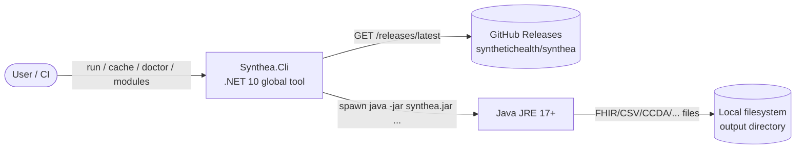
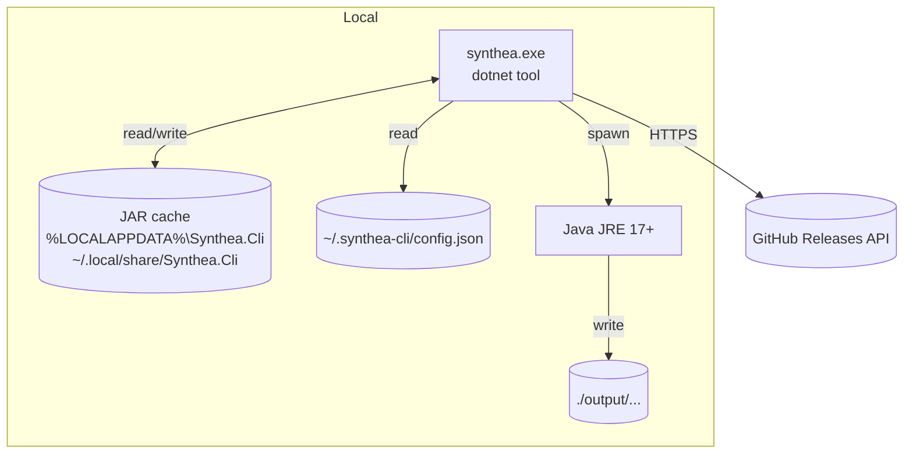
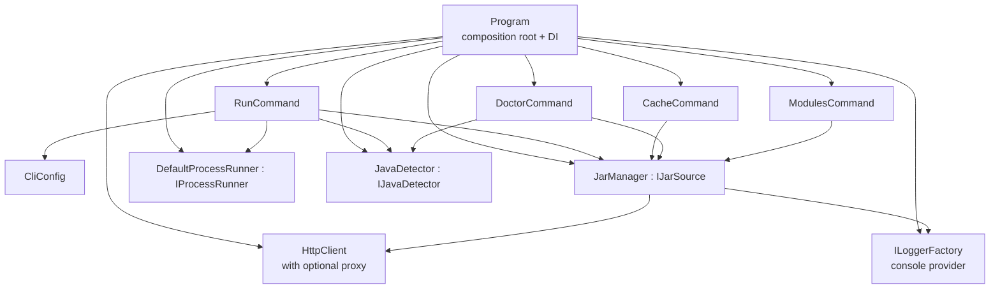
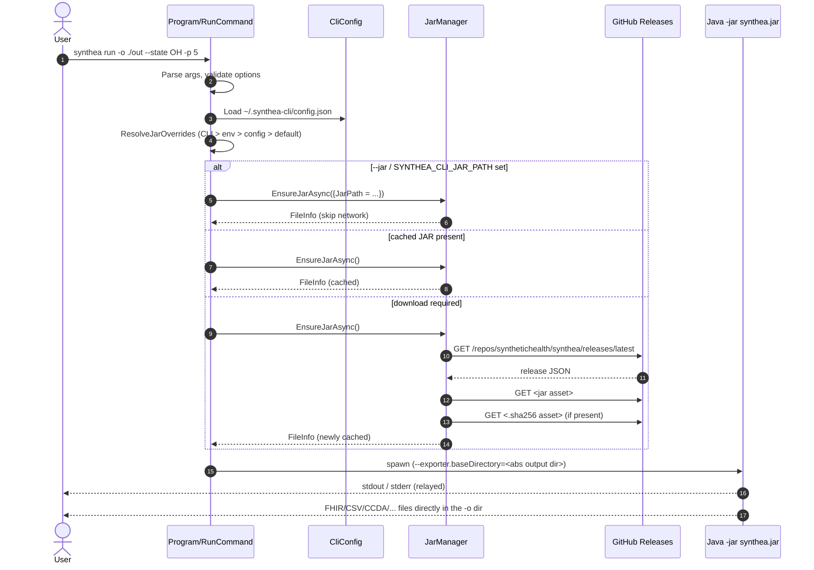

# Synthea.Cli Architecture

> A C4-style view of `Synthea.Cli`: a .NET 10 global tool that wraps the
> MITRE Synthea synthetic-patient generator, handling JAR download,
> caching, and process orchestration so users only need .NET and Java
> installed.

---

## 1. Context (C4 Level 1)

`Synthea.Cli` sits between a human (or CI agent) and the Synthea project's
release JAR. It does not implement any synthetic-patient logic itself.



Boundary of responsibility:

| In scope (this tool) | Out of scope |
|----------------------|--------------|
| CLI argument parsing & validation | Patient-generation algorithms |
| JAR download, caching, checksum | Synthea module authoring |
| Process orchestration & exit codes | FHIR/CSV export logic |
| Configuration (CLI / env / file) | Long-term storage of generated data |

---

## 2. Containers (C4 Level 2)

A "container" here is a process or persistent store the tool relies on.



| Container | Why |
|-----------|-----|
| `synthea` CLI process | The tool itself; short-lived, one invocation per run |
| JAR cache directory | Avoids re-downloading on every run; survives across invocations |
| Java JRE | Hosts the actual Synthea simulation; user-provided. Synthea v4.0 requires Java 17 or newer. |
| Config file | Persistent settings (token, proxy, default JAR path) |
| Output directory | User-controlled; the tool only ensures it exists |

---

## 3. Components (C4 Level 3)

Inside the `synthea` process:



| Component | Responsibility |
|-----------|----------------|
| `Program` | Composition root. Builds `ServiceProvider`, parses verbosity flags, dispatches root command. |
| `RunCommand` | `synthea run …` — option definitions, validators, `JarOverrides` resolution, process spawn. |
| `CacheCommand` | `synthea cache list / clear`. Reads `IJarSource.CachePath` and operates on the directory. |
| `DoctorCommand` | `synthea doctor` — environment checks (Java, cache, config, GitHub reachability, disk) via `DoctorCheck` + `IDiskSpaceProbe` / `IGitHubReachabilityProbe`. |
| `ModulesCommand` | `synthea modules list / describe` — backed by `ModuleIntrospector`, which reads module JSON out of the cached JAR. |
| `CliConfig` | Loads `~/.synthea-cli/config.json`; provides CLI > env > config > default precedence helpers. |
| `JarManager` (`IJarSource`) | Locates/downloads/verifies the Synthea JAR; per-request `Authorization` header when a token is configured. |
| `JavaDetector` (`IJavaDetector`) | Discovers Java and enforces the Java 17+ floor (fail-fast with a clear message). |
| `DefaultProcessRunner` (`IProcessRunner`) | Wraps `System.Diagnostics.Process` behind an interface so tests can stub (defined in `ProcessHelpers.cs`). |
| `JavaHeapSizer` | Static helper; sizes `-Xmx` from population `-p`, overridable with `--java-heap`. |
| `SyntheaErrorPatterns` | Static helper; maps Synthea stderr signatures to remediation hints and exit codes. |
| `SyntheaProgressParser` | Static helper; parses Synthea progress output to drive `--progress`. |
| `ILoggerFactory` | `Microsoft.Extensions.Logging` console provider; level driven by `--verbose` / `--quiet`. |
| `HttpClient` | Built once at startup with `HTTPS_PROXY` / `HTTP_PROXY` honoured via `WebProxy`. |

---

## 4. Data flow — a typical `synthea run` invocation



---

## 5. Failure modes & exit codes

| Exit | When | Where |
|------|------|-------|
| `0` | Success; Synthea's own exit code is propagated when the JAR ran | top-level handler |
| `1` | Argument validation error (state, ZIP, gender, age range, format, …), Java older than 17, or malformed config | `System.CommandLine` validators / `RunCommand` |
| `2` | Filesystem / I/O error (`IOException`) | `RunCommand` try/catch |
| `3` | External-dependency error: GitHub unreachable, checksum mismatch, missing release asset, `--insist-checksum` with no `.sha256`, **or Java not found** | `RunCommand` try/catch + Java preflight |
| `4` | Unexpected `Exception` (catch-all) | `RunCommand` try/catch |
| `130` | Cancelled by user (Ctrl+C); the child Java process is killed via `proc.Kill(entireProcessTree: true)` | cancellation registration |

Operational notes:

- The download progress line uses `\r` only when stdout is a TTY; redirected
  output gets a single `Downloading Synthea JAR…` line so log files stay
  greppable.
- `Console.OutputEncoding` is forced to UTF-8 at `Main` entry so
  diacritic patient names render correctly on Windows code pages.

---

## 6. Deployment topology

`Synthea.Cli` is published as a [.NET global tool](https://learn.microsoft.com/dotnet/core/tools/global-tools):

```bash
dotnet tool install --global Synthea.Cli
synthea --help
```

No system installer, no daemon, no admin rights. The tool drops itself
into the user's per-user `~/.dotnet/tools` directory and is on PATH after
the standard `dotnet tool` shim. Symbols package (`.snupkg`) is published
alongside the nupkg for step-into debugging.

Cross-platform: tested on Windows, macOS, Linux through the
`ubuntu-latest` + `windows-latest` CI matrix.

---

## 7. Security posture

- **`GITHUB_TOKEN`** (env or `~/.synthea-cli/config.json`) attaches as
  `Authorization: Bearer <token>` to GitHub API and asset-download
  requests. Sent per-request — not stored on `HttpClient.DefaultHeaders`
  — so it does not leak to non-GitHub URLs if `JarManager` is reused.
- **`HTTPS_PROXY` / `HTTP_PROXY`** are wired into `HttpClientHandler.Proxy`
  at startup. `HttpClient` does not expose its handler for runtime
  mutation, so per-call proxy overrides are not supported.
- **Checksum verification** runs whenever the upstream release publishes
  a `.sha256` asset. `--insist-checksum` (or
  `SYNTHEA_CLI_INSIST_CHECKSUM=true`) fails the run if no checksum is
  available; default off for backward compatibility, recommended on for
  production CI.
- **No credentials are logged.** Token and proxy values appear only in
  request construction; the structured logger emits the request URL but
  never the `Authorization` header.

---

## 8. Where to read next

- [`docs/adr/`](../adr/) — Architecture Decision Records seeded for the
  major decisions documented above.
- [`SyntheaCli-notes-design-review.md`](../../SyntheaCli-notes-design-review.md)
  — original architectural review that drove the work; finding IDs (A-N)
  referenced throughout.
- [`docs/SyntheaCli-notes-v-next.md`](../SyntheaCli-notes-v-next.md) — v1.0.0
  scope and the descope decisions (e.g. physiology) for the road ahead.
