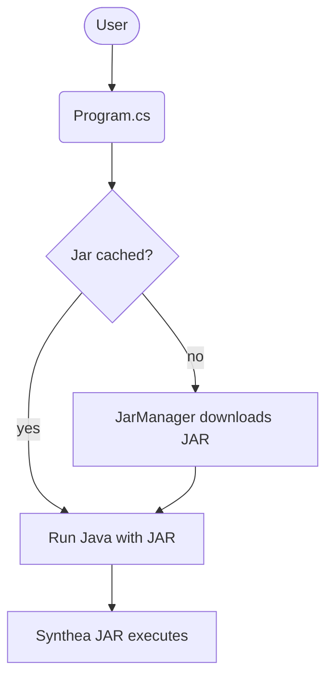

# Enterprise Architecture Evaluation

## Executive Summary
The `synthea-cli` project provides a lightweight .NET front end for the MITRE Synthea Java application. Its current architecture effectively delivers cross-platform synthetic health data generation with automated JAR management and a simple command-line interface. Unit tests and container scripts support reliability and portability. The CLI aligns with the business goal of enabling repeatable data generation for development and testing environments. Overall the solution is fit for purpose, though opportunities exist to strengthen data governance, logging, and integration with enterprise tooling.

## Current Architecture
### Repository Overview
`synthea-cli` wraps Synthea's Java JAR using **.NET 8**. `Program.cs` defines a `run` command with options such as `--output`, `--population`, and `--state`. `JarManager` downloads the latest JAR from GitHub and verifies its checksum. A suite of xUnit tests mocks network calls and process execution. Build scripts (`setup.sh`, Dockerfile) produce a NuGet package and container image.

### Business Architecture
- **Goal alignment:** Supports teams that need synthetic patient data for demos, testing, or analytics without relying on real PHI.
- **Processes:** Developers invoke the CLI directly or via CI to generate data sets. Results are stored in user-specified output directories.
- **Organization:** Open-source project maintained under MIT license; easily adopted by various teams.

### Data Architecture
- **Data sources:** Primary input is the official Synthea modules. Optional custom modules and snapshots can be provided.
- **Data flow:** Output files (FHIR, CSV, CCDA, etc.) are written to a chosen directory. No central persistence is included.
- **Governance:** Minimal governance; relies on users to manage output retention and privacy of generated data.

### Application Architecture
- **Structure:** Single .NET console project with clear separation between CLI parsing and JAR management.
- **Integration:** Delegates simulation to the Synthea JAR. Extensible through additional command options and custom modules.
- **Testing:** xUnit test suite achieves broad coverage of command handling and download logic.

### Technology Architecture
- **Platforms:** .NET 8 and Java 17 runtime requirements. Scripts automate environment setup and Docker builds.
- **Deployment:** Distributed as a global tool via NuGet and as a container image for CI/CD pipelines.
- **Infrastructure:** No persistent infrastructure needed aside from GitHub for release downloads.

## Issues and Opportunities
- **JAR Availability:** Reliance on GitHub releases introduces an external dependency that could delay builds if unavailable.
- **Limited Logging:** The CLI streams process output but lacks structured logs for enterprise monitoring.
- **Data Governance:** Generated data is stored locally without lifecycle management or compliance checks.

## Recommendations
1. **Mirror JAR Releases Internally** – Maintain an internal cache or artifact repository to reduce dependency on GitHub availability.
2. **Introduce Structured Logging** – Emit logs in a standard format (e.g., JSON) to integrate with centralized monitoring tools.
3. **Document Data Handling Practices** – Provide guidance on secure storage and retention of generated datasets.
4. **Explore Modular Packaging** – Consider packaging the CLI as a container with Synthea pre‑downloaded for offline environments.

## Action Plan
- Short term: implement structured logging and publish documentation on data retention practices.
- Medium term: establish an internal artifact mirror for Synthea JARs and update CI scripts accordingly.
- Long term: evaluate containerized distribution with prepackaged JAR to streamline deployments in isolated networks.
